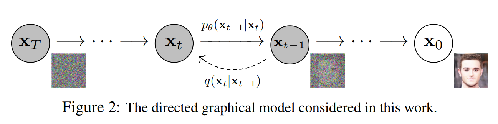

# Denoising Denoising Probalistic Model (DDPM)

主要：Denoising Diffusion Probabilistic Models. *NeurIPS 2020.*

辅以：Score-Based Generative Modeling through Stochastic Differential Equations. *ICLR 2021.*

提出若干个statement
- diffusion model的训练过程本质是在学习前向过程中加的噪声
- 学习噪声本质上是在拟合梯度上升过程中的梯度
- 去噪本质上是在对分布函数$p(x)$作梯度上升

### Overview

**目标**：从任意的高斯噪声$\mathbf{x}_T\sim \mathcal{N}(0,\mathbf{I})$生成图片$\mathbf{x_0}\sim p(\mathbf{x})$。

**前向过程**：$\mathbf{x}_0\to \mathbf{x}_1 \to \mathbf{x}_2 \to...\to \mathbf{x}_{T-1} \to \mathbf{x}_{T}$逐渐加噪，直到$\mathbf{x}_T$是一个纯高斯噪声的采样$\mathbf{x}_T\sim \mathcal{N}(0,1)$：
$$
\begin{equation}
\begin{gathered}
\mathbf{x}_t\sim q(\mathbf{x}_{t}|\mathbf{x}_{t-1})=\mathcal{N}(\sqrt{\alpha_t}\mathbf{x}_{t-1},(1-\alpha_t)\mathbf{I})\\
\text{采样:}\quad\mathbf{x}_t=\sqrt{\alpha_t}\mathbf{x}_{t-1}+\sqrt{1-\alpha_t}\epsilon_t\quad \epsilon_t\sim \mathcal{N}(0,1)
\end{gathered}
\end{equation}
$$

**（需要求解）反向过程**：$\mathbf{x}_T\to \mathbf{x}_{T-1} \to \mathbf{x}_{T-2} \to...\to \mathbf{x}_{1} \to \mathbf{x}_{0}$逐渐去噪：
$$
\begin{equation}
\begin{gathered}
\mathbf{x}_{t-1}\sim q(\mathbf{x_{t-1}|\mathbf{x_t}, \mathbf{x_0}})=\mathcal{N}(\tilde{\mu}_q, \Sigma_q)\\
\tilde{\mu}_q(\mathbf{x}_t, \mathbf{x}_0)=\frac{1}{\sqrt{\alpha_t}}x_t-\frac{1-\alpha_t}{\sqrt{1-\bar{\alpha}_t}\sqrt{\alpha_t}}\epsilon_t\\
\Sigma_q=\frac{(1-\alpha_t)(1-\bar{\alpha}_{t-1})}{1-\bar{\alpha}_t}\mathbf{I}\\

\text{采样:}\quad\mathbf{x}_{t-1}=\tilde{\mu}_q+\Sigma_q \mathbf{z}=\frac{1}{\sqrt{\alpha_t}}\left(\mathbf{x}_t-\frac{1-\alpha_t}{\sqrt{1-\bar{\alpha}_t}}\mathbf{\epsilon}_t\right)+\Sigma_q \mathbf{z}, \quad \mathbf{z}\sim \mathcal{N}(0, \mathbf{I})\\
\end{gathered}
\end{equation}
$$
其中$\epsilon_t$在反向过程中是未知量，$\Sigma_q$是常数，所以唯一需要学习的量只有$\epsilon_t$。那么我们就可以根据关于$\mathbf{x}_0$的数据集构建如下输入输出：
$$
\begin{equation}
\Big(输入，输出\Big)=\Big((x_t, t), \ \ \epsilon_t\Big)
\end{equation}
$$
构建神经网络$\epsilon_\theta(x_t, t)$学习$\epsilon_t$：
$$
\begin{equation}
\mathbb{E}_{x_0\sim p(x)}\left[C_0 \lVert \epsilon_\theta(x_t,t)-\epsilon_t\rVert _2^2\right]
\end{equation}
$$
那么我们的反向过程可以写作：
$$
\begin{equation}
\text{采样：}\quad\mathbf{x}_{t-1}=\frac{1}{\sqrt{\alpha_t}}\left(\mathbf{x}_t-\frac{1-\alpha_t}{\sqrt{1-\bar{\alpha}_t}}\mathbf{\epsilon}_\theta(x_t,t)\right)+\Sigma_q \mathbf{z}, \quad \mathbf{z}\sim \mathcal{N}(0, \mathbf{I})
\end{equation}
$$

### 另一种理解
对于一个图片分布$p(\mathbf{x})$，$p(\mathbf{x})$越大则意味着越接近一个真实图片，当我们采样$\mathbf{x}\sim p(\mathbf{x})$时候，得到的$\mathbf{x}$大概率会有比较高的$p(\mathbf{x})$值（即$\mathbf{x}$为真实图片）。但是假如我们采样$\mathbf{x}\sim \mathcal{N}(0,\mathbf{I})$，$p(\mathbf{x})$高的概率就很低（即$\mathbf{x}$不太可能是真实图片）。

所以diffusion的思路是，能不能从任意高斯采样$x\sim \mathcal{N}(0,1)$，通过梯度下降的方式求得一个局部极值（即一个真实图片）：
$$
\begin{equation}
\mathbf{x}_{max}=\argmax_x p(\mathbf{x})
\end{equation}
$$
梯度下降的方式采用的是langevin dynamic：
$$
\begin{equation}
\mathbf{x}_{t-1}\gets \mathbf{x}_{t} + \delta \nabla_{\mathbf{x}_t} \log p_t(\mathbf{x}_t)+\sqrt{2\delta} \mathbf{z}_i, \quad i=0,1,...,K
\end{equation}
$$

那么问题就转化成了如何优化下式
$$
\begin{equation}
    \mathbb{E}\left[ \lVert \nabla_{\mathbf{x}_t} \log{p_t(\mathbf{x}_t)} - s_\theta(\mathbf{x}_t, t) \rVert_2^2 \right]
\end{equation}
$$

### 求解方向$\nabla_{\mathbf{x}_t} \log p_t(\mathbf{x}_t)$

因为$\mathbf{x}_t|\mathbf{x}_{0}\sim \mathcal{N}(\sqrt{\bar{\alpha}_t} \mathbf{x}_{0}, (1-\bar{\alpha}_t)\mathbf{I})$，根据tweedie's formula，我们有：
$$
\begin{equation}
\sqrt{\bar{\alpha}_t}x_0 = x_t+(1-\bar{\alpha}_t)\nabla_{x_t}\log p(x_t)
\end{equation}
$$
又因为$x_t\sim \mathcal{N}(\sqrt{\bar{\alpha}_t}x_0, \sqrt{1-\bar{\alpha}}_t \mathbf{I})$等价于：
$$
\begin{equation}
x_t=\sqrt{\bar{\alpha}_t} x_0+\sqrt{1-\bar{\alpha}_t}\epsilon_t
\end{equation}
$$
结合上两式子可得：
$$
\begin{equation}
\nabla_{x_t}\log p(x_t)=-\frac{\epsilon_t}{\sqrt{1-\bar{\alpha}_t}}
\end{equation}
$$
其中$\bar{\alpha}_t$是常数，$\epsilon_t$是在训练过程中可获取。

可视化：从高斯分布作梯度上升使得采样点$\mathbf{x}_T$逐渐聚合到$p(\mathbf{x})$密度高的点。

### 解决$\nabla_{\mathbf{x}} \log p(\mathbf{x})$在稀疏区域不准确的问题

解决方案是给当前数据$p(\mathbf{y})$加高斯噪声$\mathcal{N}(\mathbf{y}, \sigma_i^2)$，以此起到类似数据增强的作用。随着$\sigma_i$的增大，数据会离原先的分布越遥远。理想情况下，我们希望不管在离原先分布多远的地方都有增强的数据点来提供$\nabla_{\mathbf{y}} \log p(\mathbf{y})$。所以diffusion采用了分层加噪的手段，并且对于每一层加噪数据$p_{\sigma_i}(\mathbf{x})$，我们都希望求得其$\nabla_{\mathbf{x}} \log p_{\sigma_i}(\mathbf{x})$。

因为$\mathbf{x}|\mathbf{y}\sim \mathcal{N}(\mathbf{y}, \sigma_i^2)$，所以边际分布$p_{\sigma_i}(\mathbf{x})$为：
$$
\begin{equation}
    p_{\sigma_i}(\mathbf{x})=\int p(\mathbf{y})p(\mathbf{x}|\mathbf{y}) \text{d}\mathbf{y}
\end{equation}
$$
每个边际分布的采样都可以这样获得：$\mathbf{x}+\sigma_i \mathbf{z}$。

**优化目标**：我们用$s_\theta(\mathbf{x}, i)$拟合每个分布的$\nabla_{\mathbf{x}} \log p_{\sigma_i}(\mathbf{x})$。
$$
\begin{equation}
\mathbb{E}\left[\lVert \nabla_{\mathbf{x}}\log p_{\sigma_i}(\mathbf{x})-s_\theta(\mathbf{x},i)\rVert _2^2\right]
\end{equation}
$$
当完成以上优化目标以后，使用langevin dynamics作梯度下降：
$$
\begin{equation}
\mathbf{x}_{t-1}\gets \mathbf{x}_{t} + \delta s_\theta(\mathbf{x},i)+\sqrt{2\delta} \mathbf{z}_i, \quad i=0,1,...,K
\end{equation}
$$

### 对比一下之前的优化目标和采样

$$
\begin{equation}
\begin{gathered}
\mathbb{E}_{x_0\sim p(x)}\left[C_0 \lVert \epsilon_\theta(x_t,t)-\epsilon_t\rVert _2^2\right]\\
\text{采样：}\quad\mathbf{x}_{t-1}=\frac{1}{\sqrt{\alpha_t}}\left(\mathbf{x}_t-\frac{1-\alpha_t}{\sqrt{1-\bar{\alpha}_t}}\mathbf{\epsilon}_\theta(x_t,t)\right)+\Sigma_q \mathbf{z}, \quad \mathbf{z}\sim \mathcal{N}(0, \mathbf{I})
\end{gathered}
\end{equation}
$$

学习噪声$\epsilon_t$等效于学习梯度$\nabla_{\mathbf{x}_t} p_t(\mathbf{x}_t)$

<!-- 
 -->