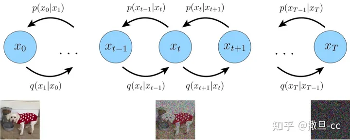

# Diffusion
*本文采用machine leanring notation*

### 问题和思路

问题描述：$\mathbf{X}$是一组采样，取自未知分布$p(\mathbf{x}_0)$，我们希望获重建它的分布$p(\mathbf{x}_0)$。

但是$p(\mathbf{x}_0)$没有显式表达式，所以像[VAE](https://zhuanlan.zhihu.com/p/575984592)问题一样，diffusion引入一个隐变量$\mathbf{z}$来辅助重建。

如果我们仅仅是重建$p_{\theta}(\mathbf{x}_0|z)$的话，那么其实和VAE也没有什么区别。Diffusion的思想是用$T$个$p_{\theta}(\mathbf{x}_{t}|\mathbf{x}_{t-1})$去拟合$p_{\theta}(\mathbf{x}_0|z)$。

$$
p(\mathbf{x}_0|\mathbf{x}_T)=\prod_{t}^T p(\mathbf{x}_{t}|\mathbf{x}_{t-1})
$$

我们最终希望获得的一个函数就是$p_{\theta}(\mathbf{x}_0|\mathbf{x}_T)$。其中$\mathbf{x}_T\sim \mathcal{N}(0,1)$为高斯分布，$\mathbf{x}_0\sim p(\mathbf{x}_0)$为$\mathbf{X}$所在的原始分布。

### 建模



前向传播和后向传播
$$
\begin{equation}
    \begin{gathered}
        q(\mathbf{x}_{0:T})=p(\mathbf{x}_0)\prod_{t=1}^T q(\mathbf{x}_{t}|\mathbf{x}_{t-1})\\
        p(\mathbf{x}_{0:T})=p(\mathbf{x}_T)\prod_{t=1}^T p_{\theta}(\mathbf{x}_{t-1}|\mathbf{x}_{t})
    \end{gathered}
\end{equation}
$$
其中每一段拟合$q(\mathbf{x}_{t}|\mathbf{x}_{t-1})$都用高斯分布，关于前向传播的两种表示方式：
$$
\begin{equation}
    \begin{gathered}
        q(\mathbf{x}_{t}|\mathbf{x}_{t-1}):=\mathcal{N}(\mathbf{x}_t; a_{t}\mathbf{x}_{t-1}, b_{t}\mathbf{I})
    \end{gathered}
\end{equation}
$$

$$
\begin{equation}
    \begin{gathered}
        q(\mathbf{x}_{t}|\mathbf{x}_{t-1}):=a_{t}\mathbf{x}_{t-1} + b_{t}\epsilon_t, \quad \epsilon_t \sim \mathcal{N}(0, \mathbf{I})
    \end{gathered}
\end{equation}
$$

这个地方加一个约束$a_t^2+b_t^2=1$可以简化$x_t$的表达式。

$$
\begin{equation}
    \mathbf{x}_t = (a_t...a_1)\mathbf{x}_0 + \sqrt{1-(a_t...a_1)^2}\bar{\mathbf{\epsilon}}, \quad \bar{\mathbf{\epsilon}}\sim \mathcal{N}(0, \mathbf{I})
\end{equation}
$$

不妨用$\sqrt{\alpha_t}$代替$a_t$，并且而外定义$\beta_t:=1-\alpha_t$，$\bar{\alpha}_t=\prod_{t=1}^t \alpha_t$那么
$$
\begin{equation}
    \begin{gathered}
        \mathbf{x}_t = \sqrt{\alpha_t}\mathbf{x}_{t-1} + \sqrt{1-\alpha_t}\mathbf{\epsilon}_t, \quad \mathbf{\epsilon}_t \sim \mathcal{N}(0, \mathbf{I})\\
        \mathbf{x}_t = \sqrt{\bar{\alpha}_t}\mathbf{x}_0+\sqrt{1-\bar{\alpha}_t}\mathbf{\epsilon}_t, \quad \mathbf{\epsilon}_t\sim \mathcal{N}(0,\mathbf{I})
    \end{gathered}
\end{equation}
$$


### 求解

我们本质上是想要求解$p(\mathbf{x}_0)$的分布，实践上我们是要重建$p_{\theta}(\mathbf{x}_0|\mathbf{x}_t)$，但是我们还是可以从$p_\theta(\mathbf{x}_0)$的**最大似然估计**入手。


$$
\begin{equation}
    \begin{split}
        \log{p_\theta(\mathbf{x}_0)} =& \log \int p_\theta(\mathbf{x}_0, \mathbf{x}_1, ..., \mathbf{x}_T)\text{d}\mathbf{x}_1...d\mathbf{x}_T\\
        = & \log \int p_\theta(\mathbf{x}_{0:T})\text{d}\mathbf{x}_{1:T}\\
        = & \log \int \frac{p_\theta(\mathbf{x}_{0:T})q(\mathbf{x}_{1:T}|\mathbf{x}_0)}{q(\mathbf{x}_{1:T}|x_0)}dx_{1:T}\\
        =&\log \mathbb{E}_{q(\mathbf{x}_{1:T}|\mathbf{x}_0)}\left[ \frac{p_\theta(\mathbf{x}_{0:T})}{q(\mathbf{x}_{1:T}|\mathbf{x}_0)}\right]\\
        \geq & \mathbb{E}_{q(\mathbf{x}_{1:T}|\mathbf{x}_0)}\left[\log{\frac{p_\theta(\mathbf{x}_{0:T})}{q(\mathbf{x}_{1:T}|\mathbf{x}_0)}}\right]\\
        =& \mathbb{E}_{q(\mathbf{x}_{1:T}|\mathbf{x}_0)}\left[ \log \frac{p(\mathbf{x}_T)\prod p(\mathbf{x}_{t-1}|\mathbf{x}_t)}{\prod q(\mathbf{x}_t|\mathbf{x}_{t-1})}\right]\text{(assuming } \mathbf{x}_t\text{ is Markov chain)}\\
        = & \mathbb{E}_{q(\mathbf{x}_{1:T}|\mathbf{x}_0)}\left[\log{p(\mathbf{x}_T)} + \sum_{t\geq 1}\log{\frac{p_{\theta}(\mathbf{x}_{t-1}|\mathbf{x}_t)}{q(\mathbf{x}_t|\mathbf{x}_{t-1})}}\right]=:L\\
        = & \mathbb{E}_{q(\mathbf{x}_{1:T}|\mathbf{x}_0)}\left[\underbrace{D_{KL}(q(\mathbf{x}_T|\mathbf{x}_0)\left|\right| p(\mathbf{x}_T))}_{L_T} + \sum_{t\geq 1}\underbrace{D_{KL}(q(\mathbf{x}_{t-1}|\mathbf{x}_t,\mathbf{x}_0) \left|\right| p_{\theta}(\mathbf{x}_{t-1}|\mathbf{x}_t))}_{L_{t-1}} - \underbrace{\log{p(\mathbf{x}_0|\mathbf{x}_1)}}_{L_0}\right]
    \end{split}
\end{equation}
$$

### 求解$L_T$
对于$L_T$，原论文里直接设$a_t$为常数，又因为
$$
\begin{equation}
    \begin{gathered}
        D_{KL}\left(\mathcal{N}(x; \mu_x, \Sigma_x) \left|\right| \mathcal{N}(y; \mu_y, \Sigma_y)\right)\\
        =\frac{1}{2}\left[ \log{\frac{\left| \Sigma_y\right|}{\left| \Sigma_x\right|}} - d + tr(\Sigma_y^{-1}\Sigma_x)+(\mu_y-\mu_x)^T \Sigma_y^{-1}(\mu_y-\mu_x)\right]
    \end{gathered}
\end{equation}
$$
所以$L_T=D_{KL}(\mathcal{N}(\sqrt{\bar{\alpha}_t} x_0, (1-\bar{\alpha}_t)\mathbf{I}) \left|\right| \mathcal{N}(0, \mathbf{I}))$为学习无关的常数（式5&7）。

### 求解$L_{t-1}$

对于$L_{t-1}$，需要建模$q(x_{t-1}|x_t, x_0)$和$p_{\theta}(x_{t-1}|x_t)$。我们先考虑$q(x_{t-1}|x_t, x_0)$的分布
$$
\begin{equation}
    \begin{split}
        q(x_{t-1}|x_t, x_0)&=\frac{q(x_t|x_{t-1},x_0)q(x_{t-1}|x_0)}{q(x_t|x_0)}\\
        &=\frac{q(x_t|x_{t-1})q(x_{t-1}|x_0)}{q(x_t|x_0)}\\
        &=\frac{\mathcal{N}(x_t; \sqrt{\alpha_t}x_{t-1},(1-\alpha_t)\mathbf{I}) \mathcal{N}(x_{t-1}; \sqrt{\bar{\alpha}_{t-1}}x_0, (1-\bar{\alpha}_{t-1})\mathbf{I})}{\mathcal{N}(x_t;\sqrt{\bar{\alpha}_t}x_0, (1-\bar{\alpha}_t)\mathbf{I})}\\
        &=...\\
        &\propto \mathcal{N}\left(x_{t-1}; \underbrace{\frac{\sqrt{\alpha_t}(1-\bar{\alpha}_{t-1})x_t+\sqrt{\bar{\alpha}_{t-1}}(1-\alpha_t)x_0}{1-\bar{\alpha}_t}}_{\tilde{\mu}_q(x_t, x_0)}, \underbrace{\frac{(1-\alpha_t)(1-\bar{\alpha}_{t-1})}{1-\bar{\alpha}_t}\mathbf{I}}_{\Sigma_q(t)} \right)
    \end{split}
\end{equation}
$$
可见$q(x_{t-1}|x_t, x_0)$遵循高斯分布，我们将其整理一下：
$$
\begin{equation}
    \begin{gathered}
        q(x_{t-1}|x_t, x_0) = \mathcal{N}(\tilde{\mu}_q(x_t, x_0), \Sigma_q(t))\\
        \text{where} \quad \tilde{\mu}_q(x_t, x_0):=\frac{\sqrt{\bar{\alpha}_{t-1}}\beta_t}{1-\bar{\alpha}_t}x_0+\frac{\sqrt{a_t}(1-\bar{\alpha}_{t-1})}{1-\bar{\alpha}_t}x_t
    \end{gathered}
\end{equation}
$$

因为$q(x_{t-1}|x_t, x_0)$遵循高斯分布（式9），不妨用高斯分布建模$p_{\theta}(x_{t-1}|x_t):=\mathcal{N}(\mu_\theta(x_t, t), \Sigma_\theta(x_t, t))$。原论文中对于$\Sigma_\theta(x_t, t)$的很简单，令$\Sigma_\theta(x_t, t)=\Sigma_q(t)$，那么$L_{t-1}$就如下式：

$$
\begin{equation}
    \begin{split}
        L_{t-1}&=D_{KL}(q(x_{t-1}|x_t, x_0) \left|\right| p_\theta(x_{t-1}|x_t))\\
        &=D_{KL}(\mathcal{N}(x_{t-1}; \tilde{\mu}_t(x_t, x_0), \tilde{\beta}_t\mathbf{I}) \left|\right| \mathcal{N}(x_{t-1}; \mu_\theta(x_t, t), \tilde{\beta}_t\mathbf{I}))\\
        &=\frac{1}{2\tilde{\beta}_t^2}\left [ \left|\right| \tilde{\mu}_q(x_t, x_0) - \mu_\theta(x_t, t) \left|\right|_2^2\right]
    \end{split}
\end{equation}
$$

### 目标函数
首先$\tilde{\mu}_q$可以又如下两种表示
$$
\begin{equation}
    \begin{split}
        \tilde{\mu}_q(x_t, x_0)&=\frac{\sqrt{\bar{\alpha}_{t-1}}\beta_t}{1-\bar{\alpha}_t}x_0+\frac{\sqrt{a_t}(1-\bar{\alpha}_{t-1})}{1-\bar{\alpha}_t}x_t\\
        &=\frac{1}{\sqrt{\alpha_t}}x_t-\frac{1-\alpha_t}{\sqrt{1-\bar{\alpha}_t}\sqrt{\alpha_t}}\epsilon_t
    \end{split}
\end{equation}
$$

因为$x_t$是输入，我们可以选择学习$\epsilon_t$或者学习$x_0$。

**优化目标**：用$\hat{\epsilon}(x_t, t)$学习$\epsilon_t$，式10会简化成如下形式：
$$
\begin{equation}
    \frac{\beta_t^2}{2\tilde{\beta_t^2}(1-\bar{\alpha}_t)\alpha_t}\left[ \left|\right| \hat{\epsilon}(x_t, t)-\epsilon_t\left|\right|_2^2\right]
\end{equation}
$$
**采样**：因为$x_{t-1}\sim q(x_{t-1}|x_t,x_0)=\mathcal{N}\left(\tilde{\mu}_q(x_t, x_0), \Sigma_q(t)\right)$，采样过程即：
$$
\begin{equation}
    \mathbf{x}_{t-1}=\frac{1}{\sqrt{\alpha_t}}\left(\mathbf{x}_t-\frac{1-\alpha_t}{\sqrt{1-\bar{\alpha}_t}}\mathbf{\epsilon}_t(\mathbf{x}_t, t)\right)+\Sigma_q \mathbf{z}, \quad \mathbf{z}\sim \mathcal{N}(0, \mathbf{I})
\end{equation}
$$

# 与score function的关系
从式(5)中可以看到$x_t\sim \mathcal{N}(\sqrt{\bar{\alpha}_t}x_0, \sqrt{1-\bar{\alpha}}_t \mathbf{I})$。根据tweedie's formular，我们有
$$
\begin{equation}
\sqrt{\bar{\alpha}_t}x_0 = x_t+(1-\bar{\alpha}_t)\nabla_{x_t}\log p(x_t)
\end{equation}
$$
又因为$x_t\sim \mathcal{N}(\sqrt{\bar{\alpha}_t}x_0, \sqrt{1-\bar{\alpha}}_t \mathbf{I})$等价于：
$$
\begin{equation}
x_t=\sqrt{\bar{\alpha}_t x_0}+\sqrt{1-\bar{\alpha}_t}\epsilon_t
\end{equation}
$$
结合上两式子可得：
$$
\begin{equation}
\nabla_{x_t}\log p(x_t)=-\frac{\epsilon_t}{\sqrt{1-\bar{\alpha}_t}}
\end{equation}
$$
所以学习$\epsilon_t$等效于学习score function。我们在下一节会展示学习$\nabla_{x_t} \log p(x_t)$的几何意义。

# Code

*https://github.com/lucidrains/denoising-diffusion-pytorch*

$\mathbf{x}_t=\sqrt{\bar{\alpha}_t}\mathbf{x}_0+\sqrt{1-\bar{\alpha}_t}\epsilon_t, \quad \epsilon_t\sim \mathcal{N}(0, \mathbf{I})$

### 初始化参数

```betas```  $\beta_t$

```alphas```   $\alpha_t$

```alphas_cumprod```   $\bar{\alpha}_t$

```alphas_cumprod_prev```   $\bar{\alpha}_{t-1}$


```sqrt_alphas_cumprod```   $\sqrt{\bar{\alpha}_t}$

```sqrt_one_minus_alphas_cumprod```   $\sqrt{1-\bar{\alpha}_t}$

```log_one_minus_alphas_cumprod```   $\log(1-\bar{\alpha}_t)$

```sqrt_recip_alphas_cumprod```   $\frac{1}{\sqrt{\bar{\alpha}_t}}$

```sqrt_recipm1_alphas_cumprod```   $\sqrt{\frac{1}{\bar{\alpha}_t}-1}$

