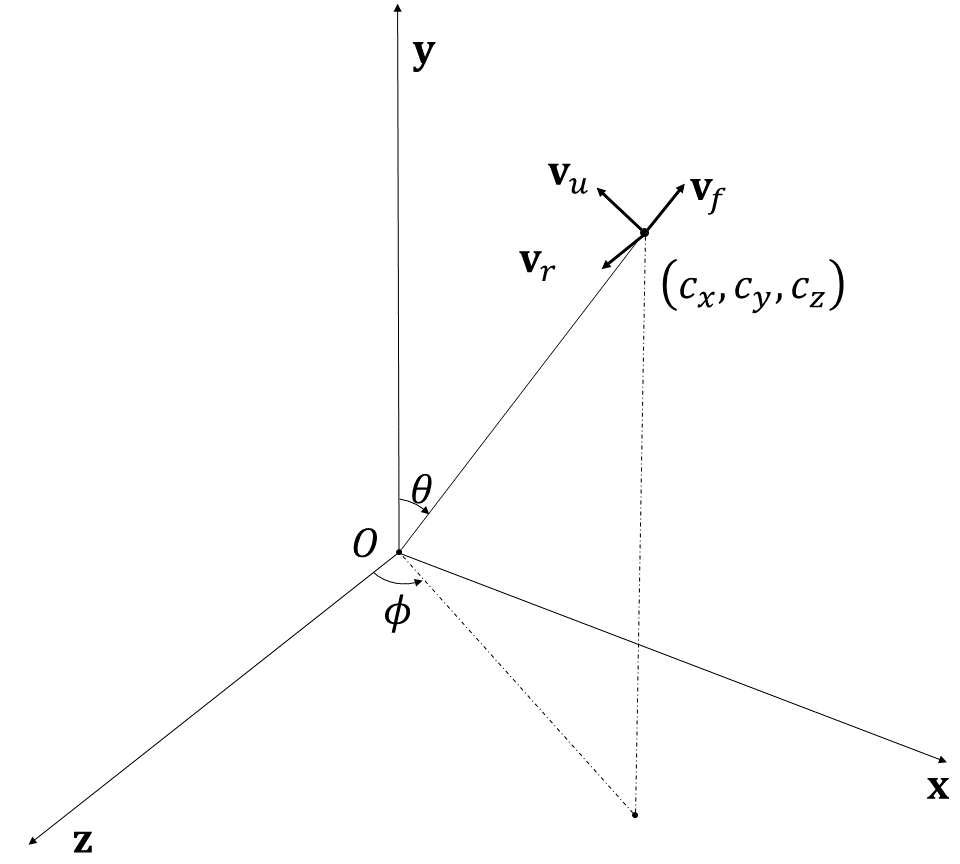
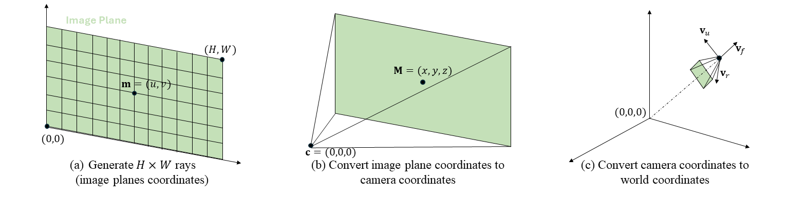

# Magic3D: High-Resolution Text-to-3D Content Creation


# Code

### 随机初始化相机位置$\mathbf{M}_{pose}$
*核心逻辑在函数```dataset.utils.rand_poses```里。*



NeRF情境下的坐标，其中相机在世界坐标$\mathbf{c}=(c_x,c_y,c_z)$下。

$$
\begin{equation}
\begin{split}
\mathbf{v}_{f}=\mathbf{v}_{forward}&=\frac{\mathbf{c}}{\lVert\mathbf{c}\rVert _2^2}\\
\mathbf{v}_{r}=\mathbf{v}_{right}&=\mathbf{v}_{f}\times\mathbf{y}\\
\mathbf{v}_{u}=\mathbf{v}_{up}&=\mathbf{v}_{r}\times \mathbf{v}_{forward}\\
\end{split}
\end{equation}
$$

基于以上，我们可以定义相机坐标转换世界坐标的矩阵$\mathbf{M}_{pose}$：
$$
\begin{equation}
\mathbf{M}_{pose}=
\begin{pmatrix}
| & | & | & |\\
\mathbf{v}_{r} & \mathbf{v}_{u} & \mathbf{v}_{f} & \mathbf{c}\\
| & | & | & |\\
0 & 0 & 0 & 0\\
\end{pmatrix}
\end{equation}
$$
假设有相机坐标下的齐次坐标$\mathbf{x}_{point}=(X,Y,Z,1)^T$（点），可以通过$\mathbf{M}_{pose}\mathbf{x}_{point}$的方式获得世界坐标：
$$
\begin{equation}
\mathbf{M}_{pose}\mathbf{x}_{point}=X\mathbf{v}_{r}+Y\mathbf{v}_u+Z\mathbf{v}_{f}+\mathbf{c}
\end{equation}
$$
及设有相机坐标下的齐次坐标$\mathbf{x}_{ray}=(X,Y,Z,0)^T$（射线），同理世界坐标下的射线：
$$
\begin{equation}
\mathbf{M}_{pose}\mathbf{x}_{ray}=X\mathbf{v}_{r}+Y\mathbf{v}_u+Z\mathbf{v}_{f}
\end{equation}
$$

关于$\mathbf{x}_{ray}$的转化还有一些常见的写法，比如相机坐标下的$\mathbf{x}_{ray}=(X,Y,Z)^T$，可以通过下面的方式算得世界坐标：
$$
\begin{equation}

\begin{pmatrix}
-&\mathbf{x}_{ray}^T&-\\
-&\mathbf{x}_{ray}^T&-\\
-&\mathbf{x}_{ray}^T&-\\
\end{pmatrix}
\odot
\begin{pmatrix}
| & | & |\\
\mathbf{v}_{r} & \mathbf{v}_{u} & \mathbf{v}_{f}\\
| & | & |\\
\end{pmatrix}
=
\begin{pmatrix}
| & | & | \\
X\mathbf{v}_{r} & Y\mathbf{v}_{u} & Z\mathbf{v}_{f}\\
| & | & |\\
\end{pmatrix}
\end{equation}
$$
沿着最后的dimension加和可以获得$X\mathbf{v}_{r}+Y\mathbf{v}_u+Z\mathbf{v}_{f}$。

### Ray生成

*核心逻辑在函数```dataset.dreamfusion.DreamFusionLoader.compute_rays```里。*



这段代码的整体pipeline如上图，最终是要生成以$\mathbf{c}$为起始点的$\text{width}\cdot \text{height}$条射线。
- 首先定义大小为$\text{focal}_x\cdot \text{focal}_y$的Image Plane；
- 我们希望从上面等分出$\text{width}\cdot \text{height}$个endpoints作为射线终点，其中endpoits的取值范围为$\{0,1,...,n-1\}$；
- 我们normalize endpoints的坐标点到$[-1, 1]^3$以内；
- 生成$\text{width}\cdot \text{height}$个射线，起点是$(0,0,0)^T$，终点是normalized endpoints
- 生成的射线通过式(5)转换到世界坐标，此时的起点是$\mathbf{c}$。

### 构建Instant-ngp

Fields of ```NGPradianceField```:
- "direction_encoding"：$\text{emb}_d$，类别为```SphericalHarmonics```的```tinycudann.Encoding```，构建映射$\mathbf{x}\in \mathbb{R}^3\mapsto\mathbb{R}^{\text{degree}^2}$
- "mlp_encoder"：$\text{emb}_e$，类别为```HashGrid```的```tinycudann.Encoding```，构建映射$\mathbf{x}\in \mathbb{R}^3\mapsto\mathbb{R}^{\text{n\_level*n\_features\_per\_level}}$（TODO：底层实现是怎么样的）
- "mlp_sigma"：volume density prediction $\Theta_\sigma(\mathbf{x})$
- "mlp_rgb"：RGB prediction $\Theta_\mathbf{c}(\mathbf{x})$
- "mlp_normal"：normal prediction $\Theta_\mathbf{n}(\mathbf{x})$
- "mlp_bkgd"：background RGB prediction $\Theta_b(\mathbf{x})$

```NGPradianceField.query_density(x)```
$$
\begin{equation}
a\left(\Theta_\sigma(\text{emb}_e(\mathbf{x}))+C\right)
\end{equation}
$$

``````