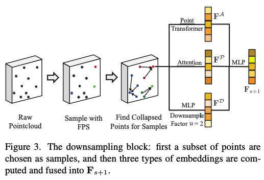

# Point Cloud

## Static

#### Density-preserving Deep Point Cloud Compression

- encoder: 3 feature extractor generate global feature
- decoder: upsampling

QA:
1. clustered points issues
   

#### Attribute Artifacts Removal for Geometry-Based Point Cloud Compression

- Compress attributes
- Multi-scale GAT
- compared RAHT

#### A Regularized Projection-Based Geometry Compression Scheme for LiDAR Point Cloud
- Geometry Compress
- Cartesian-to-cylindrical projection for downstream predictions (xyz)->(r,theta,phi)
- compare MPEG GPCC, VPCC

#### Variable Rate Compression for Raw 3D Point Clouds
[[code](https://github.com/robotic-vision-lab/Variable-Rate-Compression-For-Raw-3D-Point-Clouds)][$\star$2]
- geometry compression: one model for variable bitrate
- compare Dracro

#### TransPCC: Towards Deep Point Cloud Compression via Transformers
[[code](https://github.com/jokieleung/TransPCC)][$\star$2]
- geometry
- transformer

#### Real-Time Scene-Aware LiDAR Point Cloud Compression Using Semantic Prior Representation

- SPR: encoder 加密labels, predictions, and residuals of projected 2D image
- SPR: decoder 2d-3d recon

----
## Dynamic

#### Hilbert Space Filling Curve Based Scan-Order for Point Cloud Attribute Compression
- attribute compression
- 声明hilbert order的pc对compression有提升
- 比较的是mortion order

#### Local Geometry-Based Intra Prediction for Octree-Structured Geometry Coding of Point Clouds
- geometry compression: octree-based
- 根据（树上的）parent和（空间上的）邻居信息预测（树上的）child存在与否
- 比较MPEG anchor

#### ViVo: Visibility-Aware Mobile Volumetric Video Streaming
- 贡献visual prediction，和optimization（比如远处的pc分辨率调低）。压缩算法用的PtCl
- Mobile

#### Groot: A real-time streaming system of high-fidelity volumetric videos
- 类似vivo（用户自适应优化）
- 贡献PD-tree（解决octree的并行解码问题）
- attribute：morton-ordering & JPEG
- first mobile

QA:
1. PtCl compression schemes: Dacro, PCL, LEPCC (from Esri)

#### Evaluating the Impact of Tiled User-Adaptive Real-Time Point Cloud Streaming on VR Remote Communication
- 贡献一个算法外层的优化：因为VR中有用户和pc之间角度和距离的信息，根据这个信息可以选择性调节一些pc的分辨率

#### Vues: Practical Mobile Volumetric Video Streaming Through Multiview Transcoding
- 贡献一个外层优化：根据QoE预测视角，选中的视角得到的image作为2D view传输
- 核心是QoE和外层的这个view prediction架构
- 比较的是single view的手段（低QoE）和direct-stream（高overhead）

#### Low-latency Cloud-based Volumetric Video Streaming Using Head Motion Prediction
- 贡献一个外层优化：传viewpoint，根据viewpoint render 2Dimage

#### Pushing Point Cloud Compression to the Edge
- geometry & attribute
- spatial locality: points with similar Morton code within one frame have little variance in both geometry and attribute values
- temporal locality: the points with adjacent Morton codes (for instance, a cluster of geometrically close points) are likely to move in a certain direction, as a whole block, across frames

---
## Super resolution

#### Fractional Super-Resolution of Voxelized Point Clouds

- first intra-frame super-resolution
- super-resolve the geometry, but we also interpolate texture by averaging colors from adjacent neighbors

#### Point Cloud Video Super-Resolution via Partial Point Coupling and Graph Smoothness
- super-resolution based on 2 ideas
- inter-frame PC matching: t frame interpolation然后用motion model转化成t+1的PC
- graph Laplacian regularization (FGLR) for smoothing
- baseline是两个ablation study

#### SUPER-RESOLUTION OF 3D COLOR POINT CLOUDS VIA FAST GRAPH TOTAL VARIATION
- Attribute & Geometry SR
- Geo SR: triangular. Attribute: local avg
- size=N -> size=0.4N -> size=N

---
## Denoise
#### Graph-Based Depth Denoising & Dequantization for Point Cloud Enhancement
- 传统方法根据图片重建3D以后再优化，我们在重建之前先优化它的depth measurements
- 怎么做：graph-based denoising

---
## Others
#### Point Cloud Sampling via Graph Balancing and Gershgorin Disc Alignment
- 优化sample策略
- 证明最小化reconstruction error等同于最大化（）的最小特征值

#### INENet: Inliers Estimation Network With Similarity Learning for Partial Overlapping Registration
- 处理的问题是多sensor扫描的point cloud是不全的、多角度的，如何从多份replica中重建一个完整的出来
- 